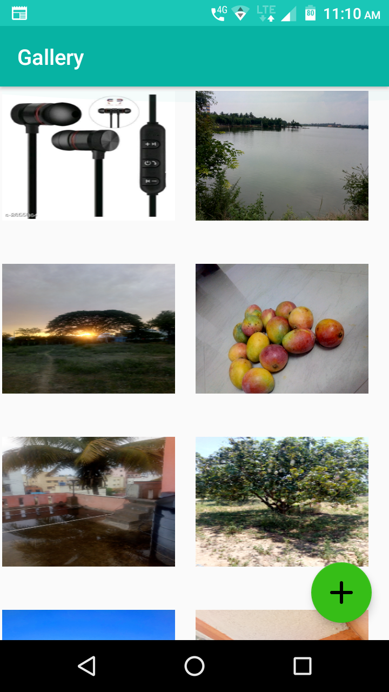
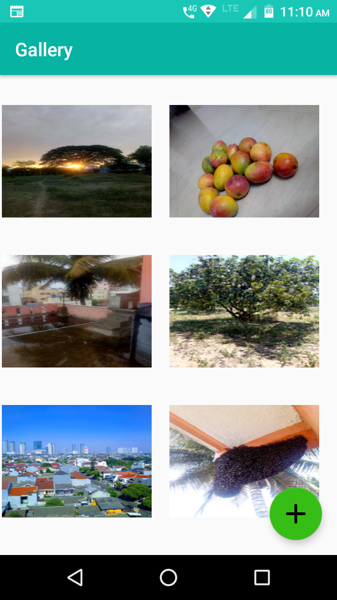

# Gallery App
This is the sample application build for Google's event called **#30Day's of Kotlin With Google**

## How does home screen looks like?
                          

## What topics are covered in this app ?
  1. Kotlin Extension function
  2. Architecture Components, LiveData, Viewmodel
  3. Activity LifeCycle 
  4. Room database and coroutines
  5. RecyclerView, ConstraintLayouts and Adapter 

## Application features?
1. Picks one image at a time from the phone storage
2. Shows Activity-View which appears has shown in screen shot 
3. Images are loaded in GridView pattern

## How to use?
1. [Install Android Studio](https://developer.android.com/studio/install.html), if you don't already have it.
2. Clone or Download the application.
3. Import the application into Android Studio.
4. Build and run the application.